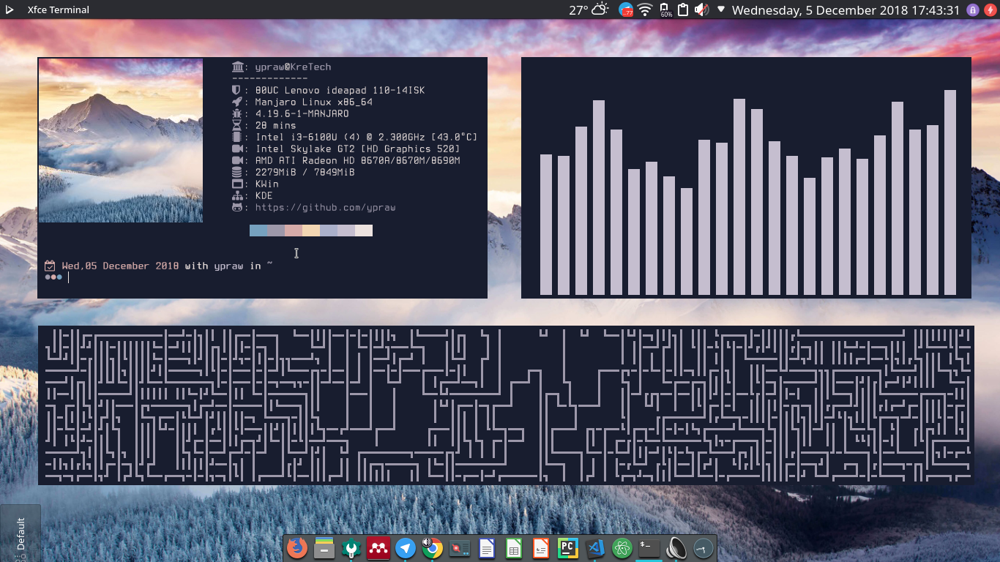

<p align="center"><h1>
<bold>
My DotFiles Configurations
<p align="center">
	<a name="top" href="https://github.com/ypraw/configDotfiles">
	</a>
</p>

</bold>
</h1>
</p>

# Details Spesifications

| Info | Value |
| :--- | :---- |
| OS  | Manjaro |
| Desktop Environtment | KDE Plasma |
| Device  | Lenovo Ideapad 110-14isk |
| Shell | Zsh, bash |
| DM | sddm |
| WM | kwin, openbox |
| icons | papirus, luv icons |
| Font | TerminessTTF Nerd Font Medium |
| Terminal | xfce4-terminal |
| Text Editor | spacevim, visual studio code |

# **Screenshoot**

### _Manjaro Gnome Version_

> Run on the screen : neofetch, vis

### **_Manjaro Plasma Version_**

> Run on the screen : neofetch, cava, spacevim


> Run on the screen : neofetch, cava

### **_Manjaro Openbox Version_**

> run on the screen : neofetch, cava, tty-clock, diamond script python 
> bar: polybar


# **INDONESIA**

Repository ini berisikan beberapa konfigurasi yang saya gunakan untuk desktop linux saya.

## Pengenalan Manjaro

_Manjaro adalah salah satu os turunan arch linux yang dirubah sedemikian rupa agar memanjakan pengguna awam untuk mencoba linux berbasis arch_

> Untuk citra manjaro, dapat diunduh di [Manjaro Page](https://manjaro.org)

## Ricing Package

  ### System Info
  
  * Neofetch powered by [dylanaraps](https://github.com/dylanaraps/neofetch)
    
    Saya merubah konfigurasi default neofetch menggunakan fontawesome. Untuk mengetes apakah konfigurasi fontawesome sudah dikenali pada system anda, cobalah untuk membuka terminal dan ketikkan kode berikut
  
    ```bash
    perl -CS -E 'say " {f19c}"'
    ```
    

    Jika hasilnya adalah icon university seperti gambar diatas, maka masukkan perintah ini pada file config neofetch anda.
    Konfigurasi dapat dilihat [disini](/neofetch/).

    ```bash
    info "$(perl -CS -E 'say "\x{f19c}"') " title
    ``` 
    
  ### FONT 
  * Saya menggunakan [**font awesome**](https://fontawesome.com/) untuk glyphy yang digunakan dan dapat didownload disini[**awesome-terminal-fonts**](https://github.com/gabrielelana/awesome-terminal-fonts).
  * Source-Code-Pro-powerline Powered by [Powerline](https://github.com/powerline/fonts)
  * awsome-terminal-fonts Powered by [gabrielelana](https://github.com/gabrielelana/awesome-terminal-fonts)

  ### BAR
  * Polybar powered by
    [jaagr](https://github.com/jaagr/polybar)

    > Konfigurasi dapat dilihat [disini](/.config/polybar)

  ### Media Visualizer
  * Vis powered by [dpayne](https://github.com/dpayne/cli-visualizer)

  ### Colorscheme
  * Pali color scheme powered by [myccoll](https://github.com/Mayccoll/Gogh)
  * pywal powered by [dylanaraps](https://github.com/dylanaraps/pywal)

  ### THEMES
  * Vimix-gtk-theme-git on [AUR](https://aur.archlinux.org/packages/vimix-gtk-themes-git/)
  * Nomad look and feel by [nomad desktop](https://github.com/nomad-desktop/nomad-plasma-look-and-feel)
  * Openbox theme hybrid with some tweaks on colors field powered by [kexolino](https://www.deviantart.com/kexolino/art/Hybrid-Openbox-Theme-429202525)

  ### SHELL
  * oh-my-zsh powered by [robbyrussell](https://github.com/robbyrussell/oh-my-zsh)
  * Autosugestions Powered by [zsh-autosuggestions](https://github.com/zsh-users/zsh-autosuggestions)
  * Spaceship-zsh-theme Powered by [Spaceship-zsh-theme](https://github.com/denysdovhan/spaceship-zsh-theme)
  * zsh-syntax-highlighgting powered by [zsh-user](https://github.com/zsh-users/zsh-syntax-highlighting)

  ### TEXT EDITOR
  * Spacevim powered by [Spacevim](https://github.com/SpaceVim/SpaceVim#linux-and-macos)

  ### OTHERS
  * Colorls iconize ls command powered by [athityakumar](https://github.com/athityakumar/colorls)


# **License**
Source is available under the [Mit License](LICENSE.md)
